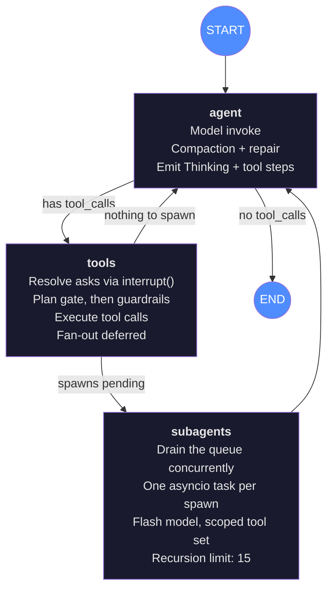
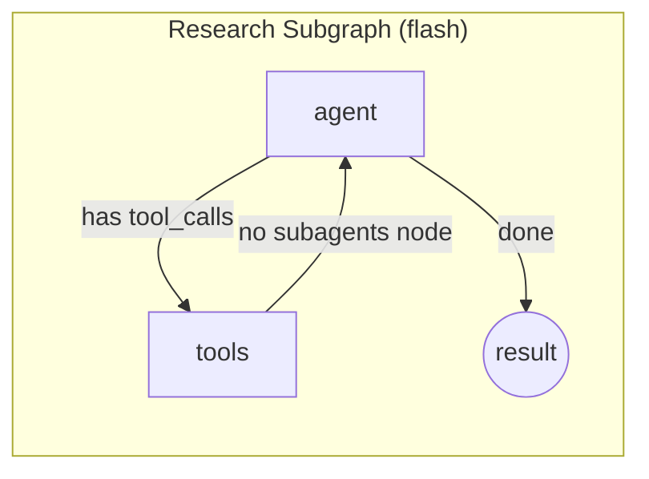

# Daimon Agent Architecture

## Agent Graph

The agent uses a custom LangGraph `StateGraph` (forked from `create_react_agent`) with an agent → tools loop and a sub-agent fan-out subgraph. The checkpointer owns conversation history — there is no module-global conversation array.

The agent node **streams**: text reaches the UI as the model writes it, and token usage is captured from every model call. The tools node can **suspend** the whole graph on a LangGraph `interrupt()` when the agent asks the user something — the turn parks in the checkpointer until `POST /resume` carries an answer back.

### Sub-agent Subgraph

Each spawn runs an independent flash-model subgraph invocation. They run **concurrently** — one asyncio task each, gathered together. Event routing survives that because a task inherits a *copy* of the context, so each sub-agent's `set_active_emit` is invisible to its siblings, and every event it produces is stamped with its own `agent_id`.

Two tools spawn: `research` (one query per line, up to 3) and `task` (one job per call — issue several in one message to run them at once). `agent_type` scopes the tool set:

| `agent_type` | Tools |
|---|---|
| `research` | `web_search`, `web_fetch`, `open_url`, `read_page`, `extract_text` |
| `explore` | `read_file`, `glob_files`, `grep_files`, `list_directory` |
| `general` | everything except spawning and asking |

No sub-agent can spawn or ask — the recursive `build_graph` call passes `role="flash"`, which produces a graph with no `subagents` node at all, so nesting is structurally impossible rather than merely discouraged.

### Key Parameters

| Parameter | Main Agent | Research Subagent |
|-----------|-----------|-------------------|
| Model | `settings.model` | `settings.resolved_flash_model` |
| Recursion limit | 40 | 15 |
| Max fan-out | — | 3 per `research` call, 4 spawns per step |
| Tool set | full | scoped by `agent_type` (see above) |
| Compaction | Yes (token threshold, written back to state) | No (bounded by recursion) |
| Streams text | Yes | No (its narration isn't the user's transcript) |

Either role's model may be a `provider:model` spec (`anthropic:claude-sonnet-5`), so the main agent can run on a strong model while sub-agents stay cheap.

## Unified Tool Set

### File Operations
| Tool | Description |
|------|-------------|
| `read_file` | Read a file from the workspace |
| `write_file` | Write/overwrite a file; creates parent directories |
| `edit_file` | Replace one occurrence of exact text in a file |
| `glob_files` | List files matching a glob pattern |
| `grep_files` | Search workspace files for a regex |
| `mkdir` | Create a directory (and parents) |
| `list_directory` | List directory contents with sizes |
| `delete_file` | Delete a file; refuses directories |
| `move_file` | Move or rename a file |

### Execution
| Tool | Description |
|------|-------------|
| `kernel_execute` | Run Python in a persistent IPython kernel; state survives across calls |
| `run_shell` | Run a shell command; blocks commands that escape the workspace (120s timeout) |

### Code Quality
| Tool | Description |
|------|-------------|
| `check_code` | Run ruff (lint) + mypy (typecheck) |
| `debug` | Run Python in an isolated subprocess with structured traceback |
| `run_tests` | Run pytest in the workspace |

### Search & Research
| Tool | Description |
|------|-------------|
| `web_search` | Search the web; returns title, URL, snippet |
| `web_fetch` | Fetch a URL as clean Markdown (no browser needed) |
| `research` | Fan out research questions to concurrent flash-model sub-agents (one per line) |
| `task` | Delegate one self-contained job to a sub-agent (`explore`/`research`/`general`) |

### Browser (optional — PinchTab)
| Tool | Description |
|------|-------------|
| `open_url` | Navigate background browser to a URL |
| `read_page` | Read visible text + interactive element listing |
| `click` | Click an element by ref |
| `fill_field` | Type text into a form field by ref |
| `new_tab` | Open a blank tab |
| `switch_tab` | Switch to a tab by id |
| `close_tab` | Close a tab by id |
| `extract_text` | Extract main article text (Readability-style) |

### Memory & Skills
| Tool | Description |
|------|-------------|
| `recall` | Search memory for past tasks, skills, and notes |
| `list_skills` | List reusable skills in the library |
| `read_skill` | Read a skill's full SKILL.md content |
| `save_skill` | Save a reusable procedure as a skill |

### Host
| Tool | Description |
|------|-------------|
| `stage_terminal_command` | Open a terminal tab with a command typed but NOT executed |

### Planning & Conferring
| Tool | Description |
|------|-------------|
| `update_todos` | Replace the visible task list; the UI renders it as a live checklist |
| `ask_user` | Ask a question with 2-4 options and wait — suspends the turn |
| `present_plan` | Show a plan and wait for approval — required before changes in plan mode |

`ask_user` and `present_plan` have no working body: the graph resolves them with `interrupt()` at the *top* of the tools node, before anything executes. That ordering is load-bearing — resuming re-runs the whole node, so a tool that had already run would run twice. Both are only offered to clients that advertise the `ask` capability.

## Event Contract (NDJSON)

The graph emits events through an `emit` closure. The server streams them as newline-delimited JSON over HTTP.

| Event | When | Fields |
|-------|------|--------|
| `step(Thinking, running)` | Agent begins model invocation | `type, id, label, status` |
| `step(id, name, running)` | Model returns tool_calls; one per call | `+ tool, detail, agent_id` |
| `step(id, name, done\|error)` | Tool execution finishes | `+ tool, detail, elapsed_ms, agent_id` |
| `assistant_delta(text)` | Model writes text | `type, text, channel?, agent_id?` |
| `usage(...)` | Each model call | `model, input_tokens, output_tokens, cache_*, cost_usd?, role` |
| `todo(items)` | `update_todos` is called | `type, items` — the whole list, always |
| `compaction(...)` | History is summarized | `before_tokens, after_tokens, dropped` |
| `done(result)` | Turn completes | `type, result, usage` |
| `error(message)` | Turn fails | `type, message` |
| `ask(...)` | Turn suspends on a question | `id, kind, question, options, multi_select, plan?` |

Events are emitted synchronously from graph-node context and enqueued. A single writer task drains the queue and writes NDJSON to the HTTP response.

The terminal events are `done`, `error`, and `ask` — exactly one per stream. `ask` is a *pause*, not an ending: the turn is parked in the checkpointer, and `POST /resume {session_id, ask_id, answer}` continues it from exactly where it stopped. The writer closes the body right after the terminal chunk, and a client disconnect mid-turn cancels the work rather than leaving an abandoned turn burning tokens.

Additions since the original port are new event *types* rather than changed shapes, and new keys are omitted when absent. A consumer written against the original contract — the Tauri app, whose `applyEvent` ignores what it doesn't recognise — keeps working untouched.

### Capability gating

`POST /task` accepts `capabilities` and `mode`. `capabilities: ["ask"]` is what makes `ask_user`/`present_plan` available at all: a client that can't answer never gets asked, so a one-shot invocation or the chat app can't be left hanging on a question nobody will see. `mode: "plan"` additionally refuses every mutating tool until a plan of the agent's has been approved — enforced in the tools node, not by prompt, because by the time you notice a model ignored "ask first", it has already written the file.

## State Repair

Before each model invocation, `_repair_orphaned_tool_calls()` scans the conversation for AIMessages with `tool_calls` that aren't followed by the corresponding ToolMessages. If the agent process was killed mid-turn (interrupted state in the checkpointer), synthetic error ToolMessages are injected so the model API doesn't reject the request with "insufficient tool messages."

## Guardrails (tools_node)

Every tool call passes through pre-execution checks:

| Guardrail | Applies to | Behavior |
|-----------|-----------|----------|
| Research budget | `web_search`, `web_fetch`, `open_url`, `read_page` | Hard limit per turn; returns warning on budget exhausted |
| Repeat check | All research tools | Same tool + same args in the same turn → blocked |
| Near-duplicate check | `web_search` | Fuzzy-duplicate query in the same turn → blocked |
| Page unchanged | `read_page` | Same content hash as previous read → warning surfaced |
