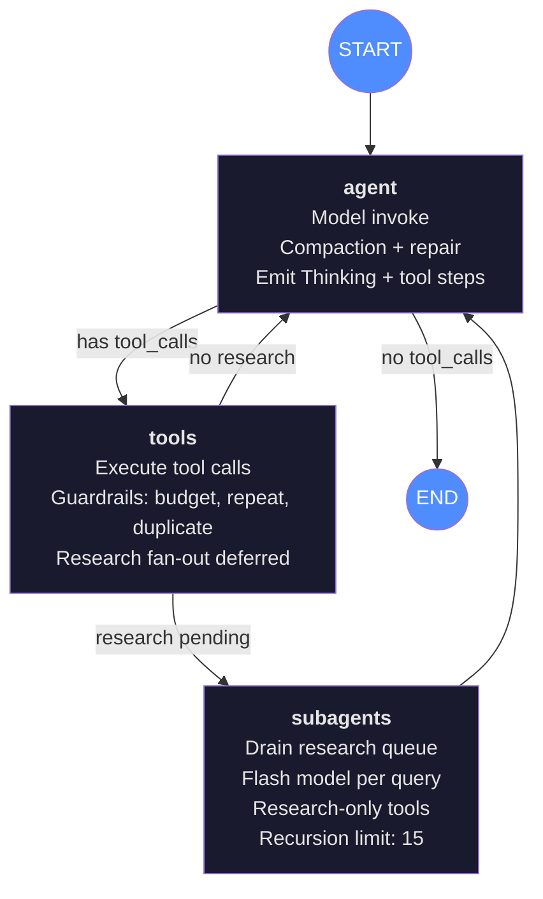
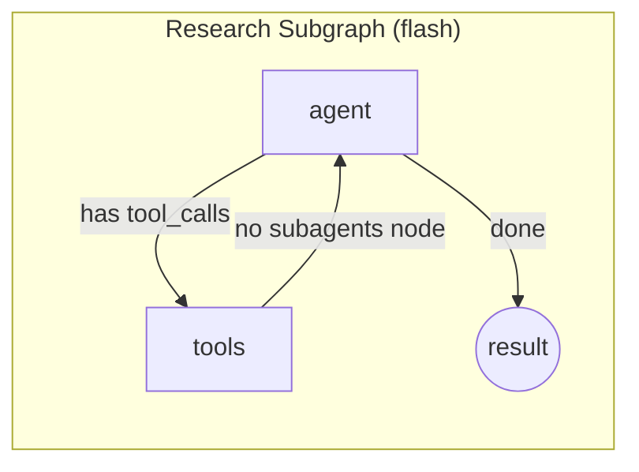

# Daimon Agent Architecture

## Agent Graph

The agent uses a custom LangGraph `StateGraph` (forked from `create_react_agent`) with an agent → tools loop and a research fan-out subgraph. The checkpointer owns conversation history — there is no module-global conversation array.

### Research Subgraph

Each research query spawns an independent flash-model subgraph invocation:

### Key Parameters

| Parameter | Main Agent | Research Subagent |
|-----------|-----------|-------------------|
| Model | `settings.model` (DeepSeek Chat) | `settings.resolved_flash_model` |
| Recursion limit | 40 | 15 |
| Max research fan-out | — | 3 queries per `research` call |
| Tool set | 30 tools (full) | 5 tools (research-only) |
| Compaction | Yes (token-threshold via flash) | No (bounded by recursion) |

## Unified Tool Set (30 tools)

### File Operations
| Tool | Description |
|------|-------------|
| `read_file` | Read a file from the workspace |
| `write_file` | Write/overwrite a file; creates parent directories |
| `edit_file` | Replace one occurrence of exact text in a file |
| `glob_files` | List files matching a glob pattern |
| `grep_files` | Search workspace files for a regex |
| `mkdir` | Create a directory (and parents) |
| `list_directory` | List directory contents with sizes |
| `delete_file` | Delete a file; refuses directories |
| `move_file` | Move or rename a file |

### Execution
| Tool | Description |
|------|-------------|
| `kernel_execute` | Run Python in a persistent IPython kernel; state survives across calls |
| `run_shell` | Run a shell command; blocks commands that escape the workspace (120s timeout) |

### Code Quality
| Tool | Description |
|------|-------------|
| `check_code` | Run ruff (lint) + mypy (typecheck) |
| `debug` | Run Python in an isolated subprocess with structured traceback |
| `run_tests` | Run pytest in the workspace |

### Search & Research
| Tool | Description |
|------|-------------|
| `web_search` | Search the web; returns title, URL, snippet |
| `web_fetch` | Fetch a URL as clean Markdown (no browser needed) |
| `research` | Fan-out parallel research queries to flash-model subagents |

### Browser (optional — PinchTab)
| Tool | Description |
|------|-------------|
| `open_url` | Navigate background browser to a URL |
| `read_page` | Read visible text + interactive element listing |
| `click` | Click an element by ref |
| `fill_field` | Type text into a form field by ref |
| `new_tab` | Open a blank tab |
| `switch_tab` | Switch to a tab by id |
| `close_tab` | Close a tab by id |
| `extract_text` | Extract main article text (Readability-style) |

### Memory & Skills
| Tool | Description |
|------|-------------|
| `recall` | Search memory for past tasks, skills, and notes |
| `list_skills` | List reusable skills in the library |
| `read_skill` | Read a skill's full SKILL.md content |
| `save_skill` | Save a reusable procedure as a skill |

### Host
| Tool | Description |
|------|-------------|
| `stage_terminal_command` | Open a terminal tab with a command typed but NOT executed |

## Event Contract (NDJSON)

The graph emits events through an `emit` closure. The server streams them as newline-delimited JSON over HTTP.

| Event | When | Fields |
|-------|------|--------|
| `step(Thinking, running)` | Agent begins model invocation | `type, id, label, status` |
| `step(id, name, running)` | Model returns tool_calls; one per call | `type, id, label, status, tool` |
| `step(Reasoning, done)` | Model returns text alongside tool_calls | `type, id, label, status` |
| `step(id, name, done)` | Tool execution completes | `type, id, label, status, tool` |
| `step(id, name, error)` | Tool execution fails | `type, id, label, status, tool` |
| `done(result)` | Turn completes | `type, result, elapsed` |
| `error(message)` | Turn fails | `type, message` |

Events are emitted synchronously from graph-node context and enqueued. A single writer task drains the queue and writes NDJSON to the HTTP response. Terminal events (`done`/`error`) are exclusive — there is exactly one per turn.

## State Repair

Before each model invocation, `_repair_orphaned_tool_calls()` scans the conversation for AIMessages with `tool_calls` that aren't followed by the corresponding ToolMessages. If the agent process was killed mid-turn (interrupted state in the checkpointer), synthetic error ToolMessages are injected so the model API doesn't reject the request with "insufficient tool messages."

## Guardrails (tools_node)

Every tool call passes through pre-execution checks:

| Guardrail | Applies to | Behavior |
|-----------|-----------|----------|
| Research budget | `web_search`, `web_fetch`, `open_url`, `read_page` | Hard limit per turn; returns warning on budget exhausted |
| Repeat check | All research tools | Same tool + same args in the same turn → blocked |
| Near-duplicate check | `web_search` | Fuzzy-duplicate query in the same turn → blocked |
| Page unchanged | `read_page` | Same content hash as previous read → warning surfaced |
